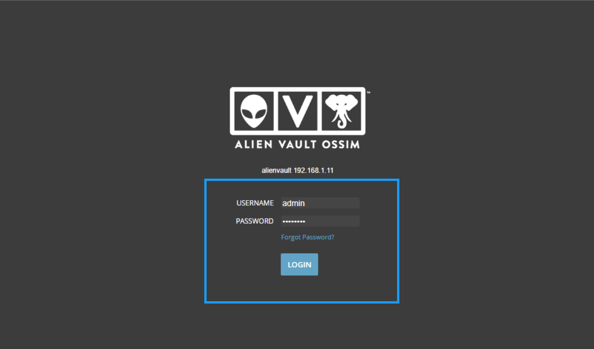
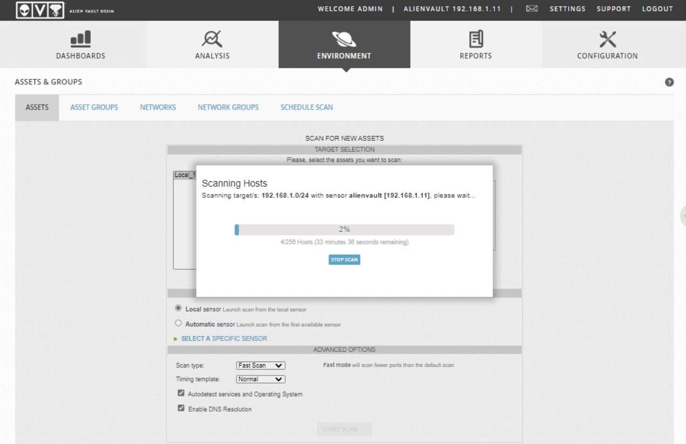
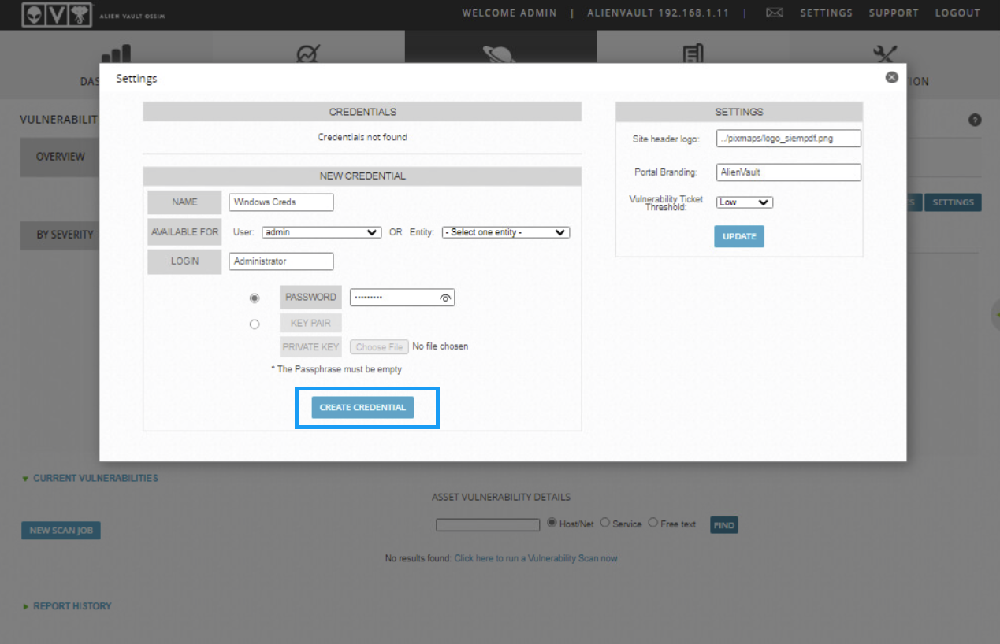
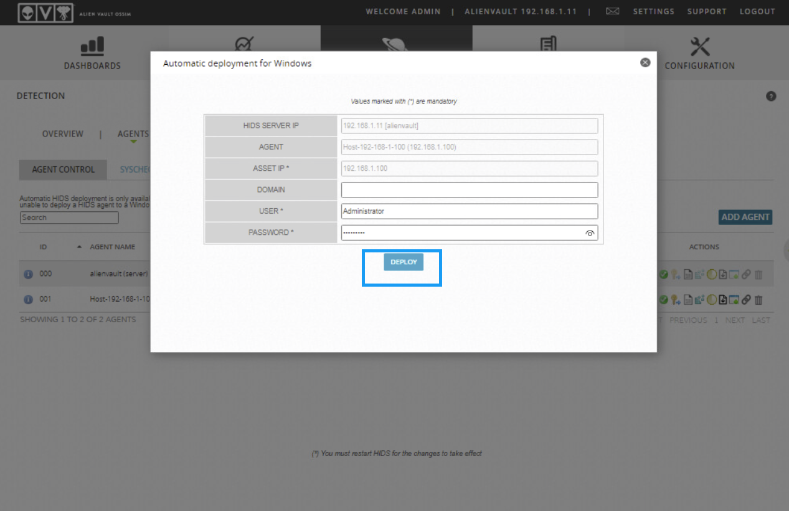
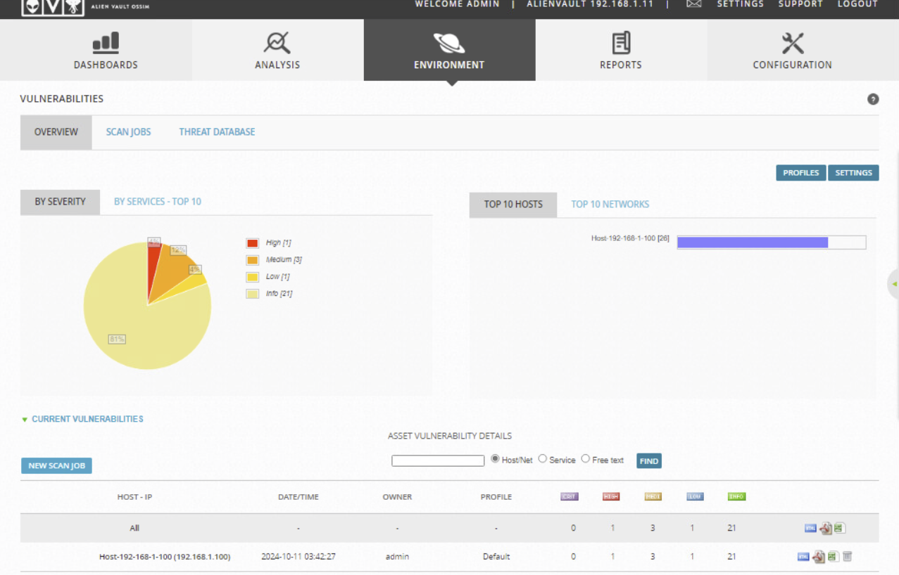

# OSSIM SIEM Lab

## Overview
This project showcases the use of **OSSIM (Open Source Security Information and Event Management)** to monitor and manage security events in a network. The lab demonstrates how to:
- Discover assets in a network
- Conduct vulnerability assessments
- Deploy a Host-based Intrusion Detection System (HIDS) agent
- Analyze results and security alerts

## Tools Used
- **OSSIM**: A popular open-source SIEM platform.

## Lab Objectives
- Analyze security requirements for a secure network architecture.
- Perform vulnerability scanning and asset discovery.
- Deploy a HIDS agent to enhance monitoring capabilities.

## Lab Steps

### 1. Login to OSSIM
- Access OSSIM by navigating to [https://127.0.0.1](https://127.0.0.1).
- Login with username `admin` and password `Pa$$w0rd`.

### 2. Scan for Assets
- Navigate to **Environment** > **Assets & Groups** and scan for new assets.

### 3. Perform Vulnerability Scan
- After discovering assets, run a credentialed vulnerability scan.

### 4. Deploy HIDS Agent
- Deploy the HIDS agent to a Windows Server to monitor file and registry changes.

## Results
- After completing the scan, view detailed vulnerability reports and alerts.

## Conclusion
This lab provided hands-on experience with using OSSIM for monitoring network security, detecting vulnerabilities, and deploying host-based security measures.
